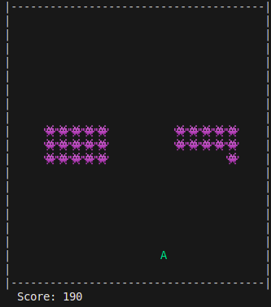

# CLI Space Invaders

A simple terminal based Space Invaders game written in Rust 

## Features

* Move player left and right using arrow keys or A/D keys
* Shoot bullets with the Spacebar
* Enemies move side to side and descend toward the player
* Win by destroying all enemies
* Lose if enemies reach the bottom

## Controls

| Key        | Action       |
| ---------- | ------------ |
| Left       | Move Left    |
| Right      | Move Right   |
| Space      | Shoot Bullet |
| Esc        | Quit Game    |

## How to Run

1. Make sure you have [Rust](https://rustup.rs/) installed
2. Clone or download this repository
3. Run the game using Cargo:

```bash
cargo run
```

## Sneak Peek

.


